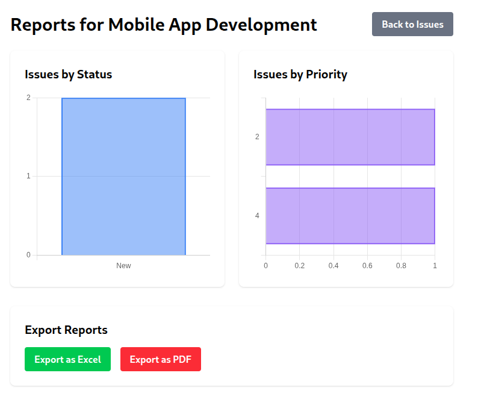
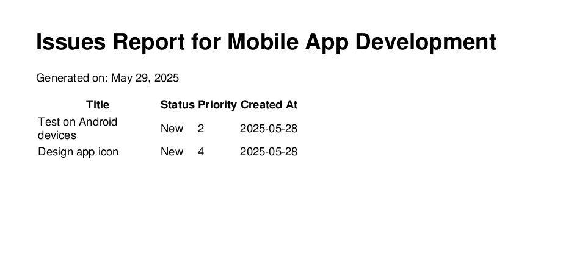

# Rails Issue Tracker

A simple Rails application for tracking project issues with reporting and export capabilities.

## Features

- Project management (CRUD)
- Issue tracking with status and priority
- Graphical reports (status/priority distribution)
- Export to Excel (XLSX) and PDF formats
- Responsive UI with Tailwind CSS

## Prerequisites

- Ruby 3.2.2 or later
- Rails 8.0.0 or later
- PostgreSQL 12+
- Node.js 16+
- Yarn 1.22+

## Setup Instructions

### 1. Clone the Repository

```bash
git clone https://github.com/yourusername/issue_tracker.git
cd issue_tracker
```

## Install Dependencies

# Ruby gems
bundle install

# JavaScript packages
yarn install

# Create and migrate database
rails db:create
rails db:migrate

# Optional: Seed with sample data
rails db:seed

## Start the Application
./bin/dev

# Testing
rails test

# Note

If PDF generation fails:

Install wkhtmltopdf:

## Ubuntu/Debian
sudo apt-get install wkhtmltopdf

## MacOS
brew install --cask wkhtmltopdf
### Verify installation:

wkhtmltopdf --version

# Screenshots 
### Chart


### PDF-Screenshot


# Demo
Click here for a short demonstration of the project </br>
